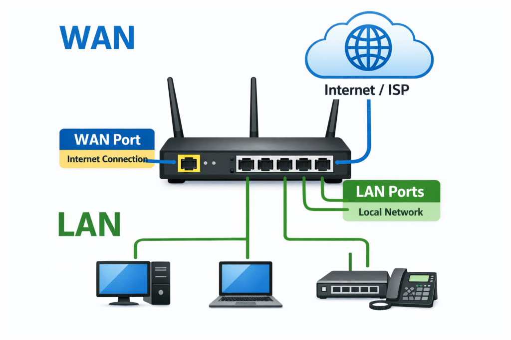
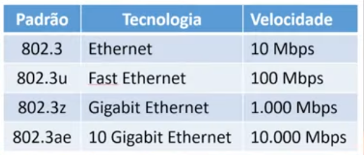

# Roteador, Modem e configurações de Rede iniciais

## Modem e Roteador

Modem e Roteador são coisas completamente diferentes. Para conhecimento inicial o modem e o roteador são coisas diferentes, o modem é a ponte a internet do fornecedor, por tanto não tem como objetivo distribuir a internet, o roteador por sua vez tem como objetivo distribuir a internet aos dispositivos, priorizando essa função, além disso ele disponibiliza mais privacidade e segurança criando uma rede LAN (um sistema que conecta dispositivos em uma área restrita). Pode aver dispositivos modem e roteador que é a maioria dos casos hoje em dia, porém os pontos aboradados valem o mesmo para esses dispositivos. 

## Configurações de hardware para modem e roteador

Para configurar o roteador primeiramente devemos verificar as partes físicas. Inicialmente vamos usar um cabo de rede para conectar o modem ao roteador, em uma das portas LAN do modem conectamos o cabo, no roteador conectamos na porta WAN, através dessa conexão o roteador vai ter acesso livre a internet. Depois de verificar a parte física, podemos entender mais sobre os tipos de roteador e modem.

Portas do modem (LAN e WAN): 
 

Os roteadores tem limites de MBPS (Megabits Por Segundo). Todos os roteadores (incluindo roteadores modem) tem um limite de MBPS que podem alcançar, os roteadores possuem uma placa de rede que pode alcançar certos limites, esses limites podem ser identificados por tecnologia, a velocidade de MBPS varia nos roteadores de 10 MBPS a 10.000 MBPS.

Tabela de MBPS: 
 

Codigo Chave do modem A maioria das operadoras disponibilizam o codigo chave para acessar o modem, atrás dos dispositivos seja ele modem ou roteador modem, podemos achaver esse codigo, algumas operadoras não disponibilizam por motivos pessoais, para reversão desse problema podemos usar chaves padrão que geralmente funciona ou um roteador. Caso as opções apresentadas sejam inviaveis, podemos ligar para operadora e solicitar o codigo.

## Acesso as configurações de Rede

Para configurarmos a rede devemos acessar o modem. Para acessar o Modem podemos acessar o Gateway Padrão (É o endereço IP do dispositivo) atráves das configurações de rede do Windows ou Linux, ou podemos acessar pelo terminal digitando "ipconfig" no Windows e "ip route show" no Linux, após pegar o endereço IP basta digitalo em seu navegador padrão. Dependendo da operadora a interface vai ser diferente, porem a lógica é a mesma, no inicio veremos o login inicial pedindo usuário e senha, basta pegar a senha do modem e o usuário. As configurações de acesso a internet estão todas nessa interface. Essa Interface é a base de todas as configurações de acesso a internet, podemos ver as entradas, Diagnósticos, Informações do dispositivo, entre outras opções que adiministram sua rede conforme sua vontade.

## Configuração sem fio para Modem e Roteador separados

acessando as configurações vá em "Sem fio" e desabilite a opção "Habilitar sem fio". A opção desabilitada serve para tirar o acesso a internet sem fio, isso serve para deixar apenas o roteador responsavel pela internet, evitando a existência de duas redes WI-FI diferentes. 